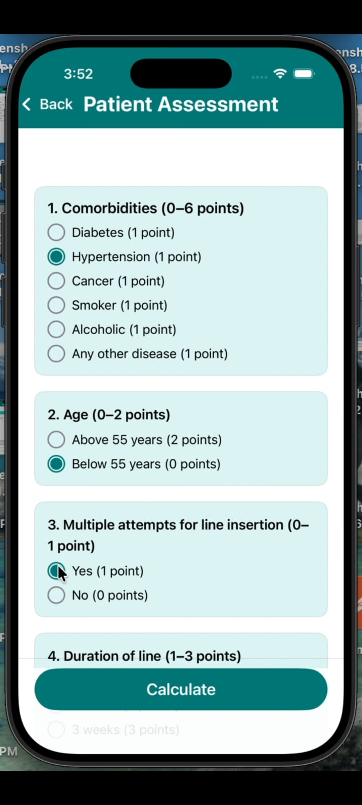

# Renal Guard: IJV Line Risk and Health for Dialysis

## 📌 Project Overview

Renal Guard is a Clinical Decision-Support Application designed to improve the safety and management of hemodialysis patients using Internal Jugular Vein (IJV) catheters.

The application helps healthcare professionals assess catheter-related risks, monitor sepsis indicators, manage appointments, and provide dietary guidance through a secure and user-friendly platform.

---

## 🎯 Business Problem

Hemodialysis patients using IJV catheters face several challenges:

- Catheter-related infections
- Thrombosis and catheter dysfunction
- Delayed sepsis detection
- Missed follow-up appointments
- Lack of integrated dietary guidance
- Manual and time-consuming risk assessments

These issues can increase healthcare costs, hospitalization rates, and patient complications.

---

## 💡 Solution

Renal Guard provides an automated risk assessment and patient management system that enables:

- IJV Catheter Risk Scoring
- Sepsis Risk Assessment
- Appointment Scheduling
- Patient Monitoring
- Dietary Guidance
- Doctor–Patient Communication
- Secure Role-Based Access

---

## 🛠 Technology Stack

### Frontend
- Swift
- SwiftUI

### Backend
- PHP

### Database
- MySQL

### Security
- HTTPS Encryption
- AES-256 Data Protection
- Role-Based Access Control

---

## 🏗 Application Architecture

### User Roles

#### Admin
- Manage doctor accounts
- System administration

#### Doctor
- Assess patient risks
- View patient records
- Schedule appointments
- Monitor patient progress

#### Patient
- Register/Login
- View risk scores
- Book appointments
- Access dietary guidance

---

## ⚙️ Core Features

### 1. IJV Risk Scoring System
- 25-point clinical scoring model
- Categorizes patients into:
  - Low Risk
  - Moderate Risk
  - High Risk

### 2. Sepsis Assessment
- Temperature Monitoring
- WBC Analysis
- CRP Evaluation
- Procalcitonin Assessment

### 3. Line Management
- Infection prevention recommendations
- Catheter care guidance

### 4. Appointment Management
- Doctor scheduling
- Patient booking
- Reminder notifications

### 5. Dietary Guidance
- Fluid restriction recommendations
- Potassium management
- Phosphate control
- Protein intake guidance

---

## 📊 Key Performance Indicators (KPIs)

| KPI | Result |
|------|---------|
| Average Risk Assessment Time | 1.8 Seconds |
| Appointment Processing Time | Under 2 Seconds |
| App Launch Time | 2.5 Seconds |
| Earlier Sepsis Detection | 30% Improvement |
| Missed Appointment Reduction | 42% Reduction |
| Faster Risk Evaluation | 25% Improvement |
| Doctor Satisfaction | 91% |
| Patient Satisfaction | 89% |

---

## 🚀 Testing & Validation

### Functional Testing
- Authentication Module
- Risk Scoring Engine
- Sepsis Assessment
- Dietary Guidance
- Appointment Management
- Admin Dashboard

### Security Testing
- Role-Based Access Control
- SQL Injection Protection
- Brute Force Protection
- Data Encryption

### Integration Testing
- Real-time synchronization between doctors and patients
- Appointment updates across modules
- Dynamic user management

---

## 📈 Future Enhancements

- AI-Based Risk Prediction
- Machine Learning Analytics
- IoT Dialysis Device Integration
- Real-Time Monitoring
- Cloud-Based Healthcare Platform
- Predictive Health Alerts

---

## 📂 Repository Structure

```text
Renal-Guard/
├── Backend (PHP)/
├── Renal Guard.xcodeproj/
├── localhost.sql
├── screenshots/
│   ├── APP Logo Page.jpeg
│   ├── Assessment.jpeg
│   ├── Doctor Dashboard.jpeg
│   ├── Login Page.png
│   ├── Patient Dashboard.jpeg
│   └── Risk Analysis.jpeg
└── README.md
```

---

## 📱 Application Screenshots

### App Logo


### Login Page


### Doctor Dashboard


### Patient Assessment


### Risk Analysis


### Patient Dashboard


---

## 🌟 Project Outcome

Renal Guard successfully combines clinical decision support, risk evaluation, appointment management, and patient engagement into a single healthcare platform.

### Key Achievements
- Improved dialysis patient safety
- Faster clinical decision-making
- Early identification of sepsis risks
- Better appointment adherence
- Enhanced doctor–patient communication
- Secure healthcare data management
- Scalable architecture for future AI integration

Renal Guard demonstrates how technology can improve healthcare workflows while supporting evidence-based clinical decisions and better patient outcomes.
